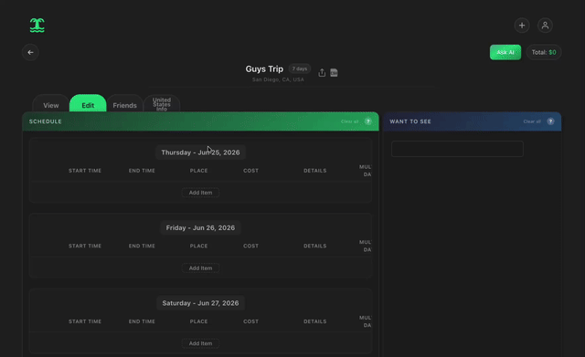
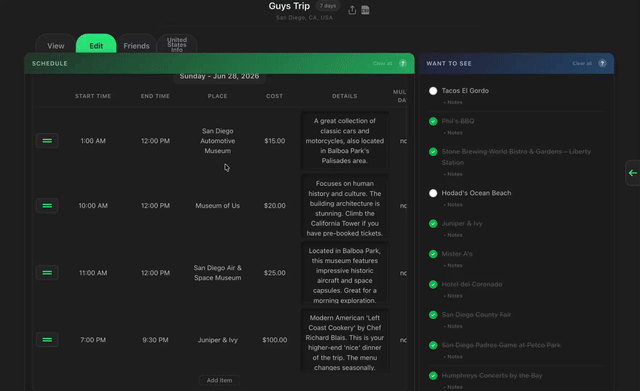
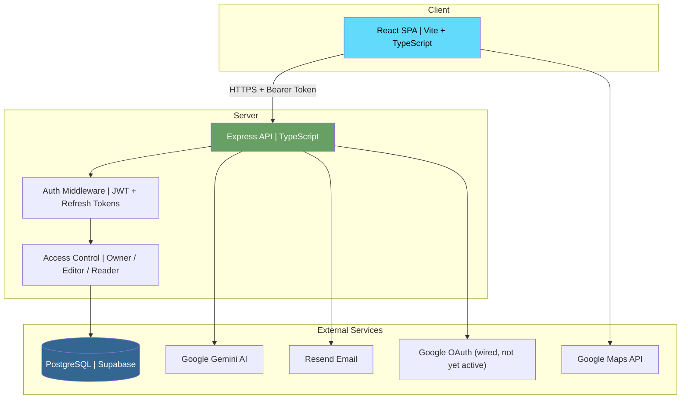
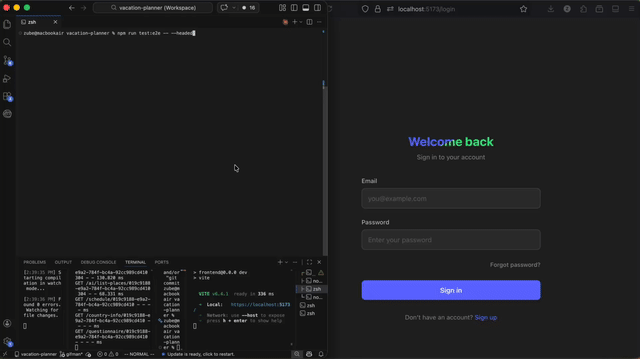

<p align="center">
  
  
</p>

<h1 align="center">Vacation Planner</h1>

<p align="center">
  Plan trips, build itineraries with AI, and share your travel journal with friends.
</p>

<p align="center">
  <a href="YOUR_LIVE_DEMO_URL"><strong>Live Demo</strong></a>
</p>

---

<p align="center">
  <a href="YOUR_LOOM_URL">
    
  </a>
</p>

## Overview

Vacation Planner is a full-stack travel planning app where users create day-by-day itineraries, get AI-powered recommendations from Google Gemini, track countries they've visited on an interactive world map, and collaborate on trips with friends through role-based sharing.

Built as a solo project to demonstrate production-level full-stack development: JWT authentication with refresh tokens, real-time collaboration permissions, drag-and-drop scheduling, AI chat integration, and a social layer with follows, notifications, and shared trip feeds.

## Core Features

- **AI-Powered Trip Planning** - Chat with Google Gemini to generate schedules, get place recommendations, and build itineraries from a wish list
  <!--  -->
  
- **Drag-and-Drop Itinerary Builder** - Reorder schedule items with drag-and-drop, inside schedule and from list.
  <!--  -->
  
- **Interactive World Map** - Visualize visited countries
- **Travel Log** keep a historical log of countries you've been to and notate cities/restaurants/hotels/excursions per country for future reference and for friends to see your recommendations
- **Trip Collaboration** - Share trips with owner/editor/reader permissions, real-time access control
- **Social Features** - Follow friends, browse a public trip feed, receive notifications for follows and invitations, see when a friend is currently on a trip, see when friends are planning trips that are open invites and tag along!
- **Guest Mode** - Plan trips without an account using localStorage, then migrate data on signup

## Tech Stack

### Frontend

|                                                         &nbsp;                                                         | Technology                                  |
| :--------------------------------------------------------------------------------------------------------------------: | ------------------------------------------- |
|                     | React 19 + TypeScript                       |
|            | Vite                                        |
|  | Tailwind CSS + CSS Modules                  |
|  | React Router v7                             |
|            | Google Maps API (@vis.gl/react-google-maps) |
|            | Vitest + Testing Library + MSW              |

### Backend

|                                                                                        &nbsp;                                                                                         | Technology                             |
| :-----------------------------------------------------------------------------------------------------------------------------------------------------------------------------------: | -------------------------------------- |
| <picture><source media="(prefers-color-scheme: dark)" srcset="https://cdn.simpleicons.org/express/white"/></picture> | Express v5 + TypeScript                |
|                                                                          | PostgreSQL (Supabase)                  |
|                                                                           | node-postgres (raw SQL, no ORM)        |
|                                                                                                             | JWT (access + refresh tokens) + bcrypt |
|                                                                           | Google OAuth                           |
|                                                                                  | Google Gemini AI                       |
|                                                                   | Playwright (E2E) + Vitest + Supertest  |

---

## Architecture



**Key architectural decisions:**

- Raw SQL over an ORM for full query control and performance
- JWT access tokens (1h) + HTTP-only refresh token cookies (7d) for secure session management
- Middleware chain for authorization: `ensureLoggedIn` -> `ensureTripAccess` -> route handler
- Context API for global state (auth, trip refresh) instead of heavier state management
- Lazy-loaded routes for code splitting (schedule, edit canvas, world map)

## API Documentation

<!-- For full interactive docs: [Swagger UI](YOUR_GITHUB_PAGES_URL) -->

See [docs/API.md](docs/API.md) for the full static API reference. Key endpoints:

| Method | Endpoint            | Description                                          |
| ------ | ------------------- | ---------------------------------------------------- |
| `POST` | `/auth/login`       | Authenticate user, returns JWT + sets refresh cookie |
| `POST` | `/signup`           | Register with email verification                     |
| `GET`  | `/vacation/:tripId` | Get trip with schedule, list, and sharing info       |
| `POST` | `/vacation`         | Create a new trip with schedule items                |
| `POST` | `/ai/chat`          | Send a message to Gemini AI for trip recommendations |

## Testing & Quality Assurance

<!--  -->


**Test coverage across three layers:**

- **Unit tests** - Shared validation utils, backend helpers (`snakeToCamel`, `checkIndexSpacing`)
- **Integration tests** - API routes with in-memory PostgreSQL (`pg-mem`) + Supertest
- **E2E tests** - Playwright browser tests for schedule CRUD and guest-to-auth flows

```bash
# Run all tests
npm test

# Run E2E tests (requires dev servers running and env variables E2E_EMAIL and E2E_PASSWORD)
npm run test:e2e
```

## Quick Start

```bash
git clone https://github.com/zubairumatiya/vacation-planner.git
cd vacation-planner

# Install dependencies (frontend + backend)
cd frontend && npm install && cd ../backend && npm install && cd ..

# Set up environment variables (see docs/ENV.md)
cp backend/.env.example backend/.env
cp frontend/.env.example frontend/.env

# Terminal 1: Compile TypeScript (watches for changes)
cd backend && tsc --watch

# Terminal 2: Run backend server (auto-restarts on compiled changes)
cd backend && nodemon dist/backend/server.js

# Terminal 3: Start frontend dev server
cd frontend && npm run dev
```

> Full setup with prerequisites, database configuration, and troubleshooting: **[docs/INSTALL.md](docs/INSTALL.md)**
>
> Environment variable reference: **[docs/ENV.md](docs/ENV.md)**

---

## Challenges & Learnings

### Technical Case Study & Post-Mortem

Deep dives into the hardest problems solved during development, including a multi-layered Google Maps API cost optimization strategy, JWT refresh token race conditions, drag-and-drop index spacing in PostgreSQL, and managing guest-to-authenticated data migration.

**[Read the Case Study ->](docs/CASE_STUDY.md)**

### Project Evolution & Refactor Log

How the architecture evolved from a simple CRUD app to a collaborative platform with AI, social features, and role-based access control.

**[Read the Evolution Log ->](docs/EVOLUTION.md)**

## Future Roadmap

- [ ] Real-time collaboration with WebSockets
- [ ] React Native app
- [ ] Implement MCP
- [ ] Tags/badges for schedule items
- [ ] Trip templates and public trip cloning
- [ ] Budget tracking with currency conversion
- [ ] Offline mode with service worker sync
- [ ] CI/CD pipeline with GitHub Actions

## Known Issues

Track all bugs and enhancements on [GitHub Issues](https://github.com/zubairumatiya/vacation-planner/issues).

**Current known issues:**

- Google Maps API is on the free tier — map may stop loading if usage quota is reached. [issue #19](https://github.com/zubairumatiya/vacation-planner/issues/19)
- Collaborative editing is not real-time (no WebSockets yet) — concurrent edits trigger a 409 conflict, prompting users to overwrite or discard rather than syncing live [issue #20](https://github.com/zubairumatiya/vacation-planner/issues/20)
- Country territories and certain regions (e.g., Greenland, Puerto Rico) cannot be interacted with on the world map due to limitations in the TopoJSON dataset [issue #21](https://github.com/zubairumatiya/vacation-planner/issues/21)
- Gemini API free tier usage limits [issue #22](https://github.com/zubairumatiya/vacation-planner/issues/22)

---

<p align="center">
  Built by <a href="https://github.com/zubairumatiya">Zubair Umatiya</a>
</p>
